# Diagramas de Arquitectura

## 1. Data Flow: UI → Query → Fake API → Cache → UI

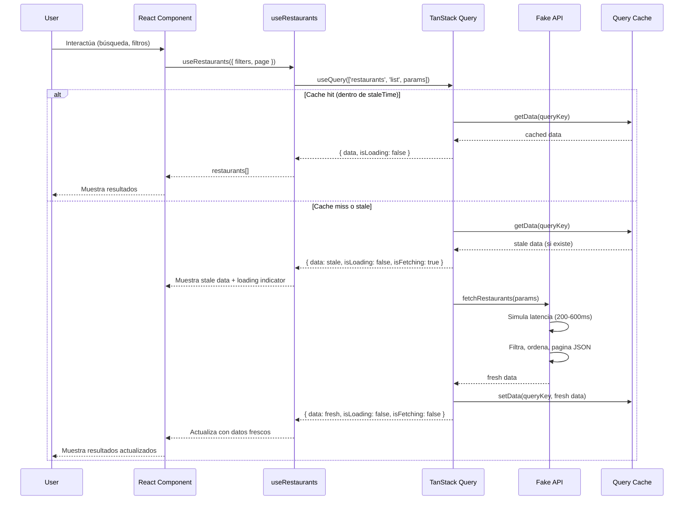

## 2. Tracking / Telemetry: Eventos → Collector → Provider

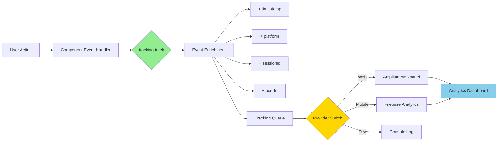

### Ejemplo de Flujo Completo

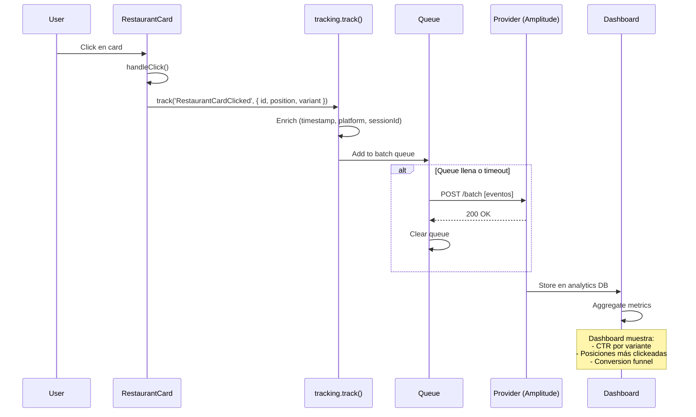

## 3. Experiments: Assignment → Persistence → Exposure → Variant UI

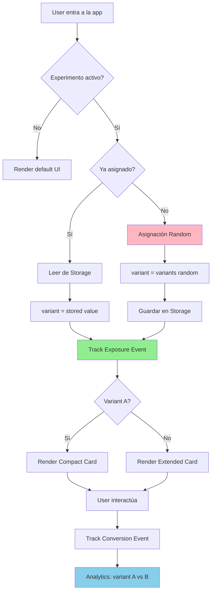

### Persistence por Plataforma

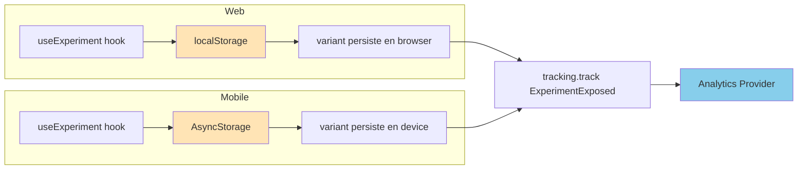

## 4. Arquitectura General - Capas

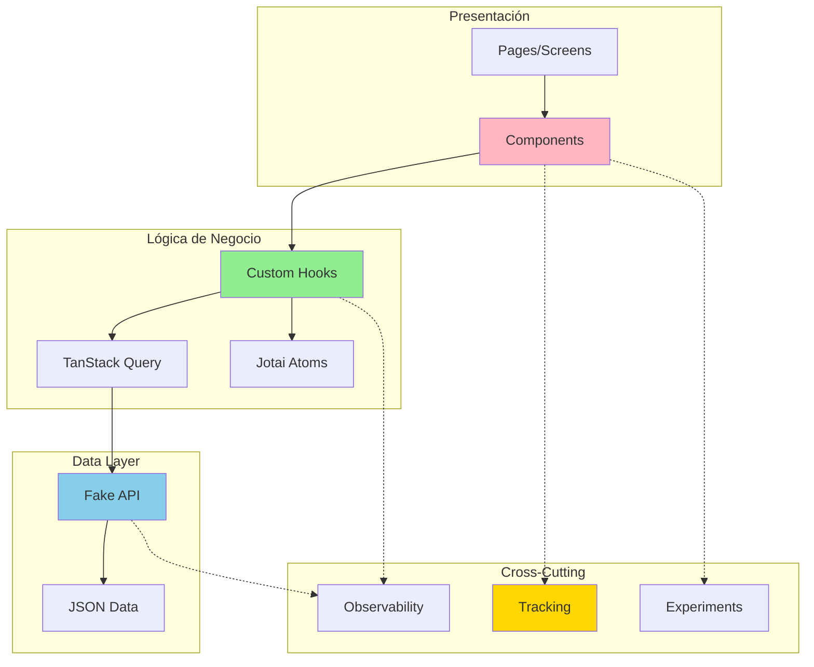

## 5. Estado: Dónde Vive Cada Pieza

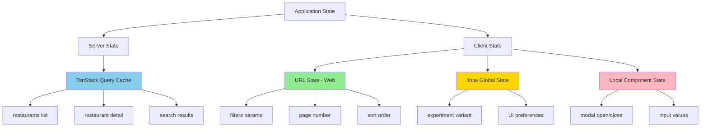

## 6. Mobile: Navigation Flow

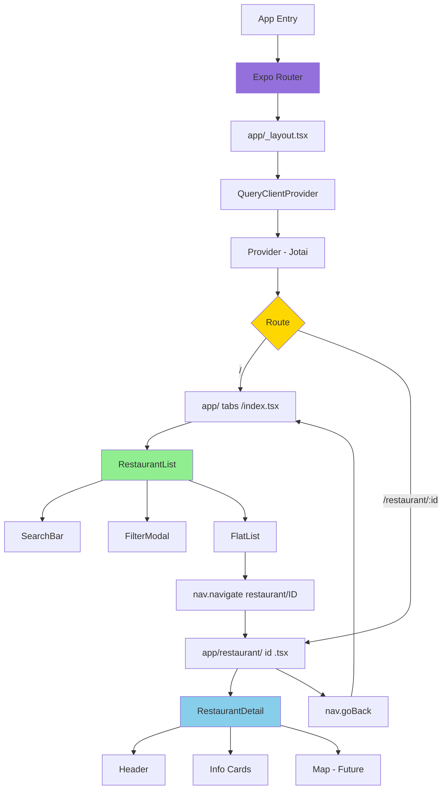

## 7. Fake API: Request Processing

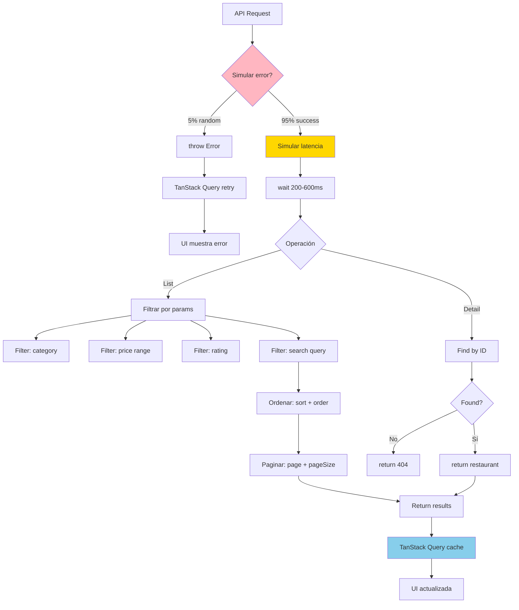

## Notas de Implementación

### Performance Optimizations

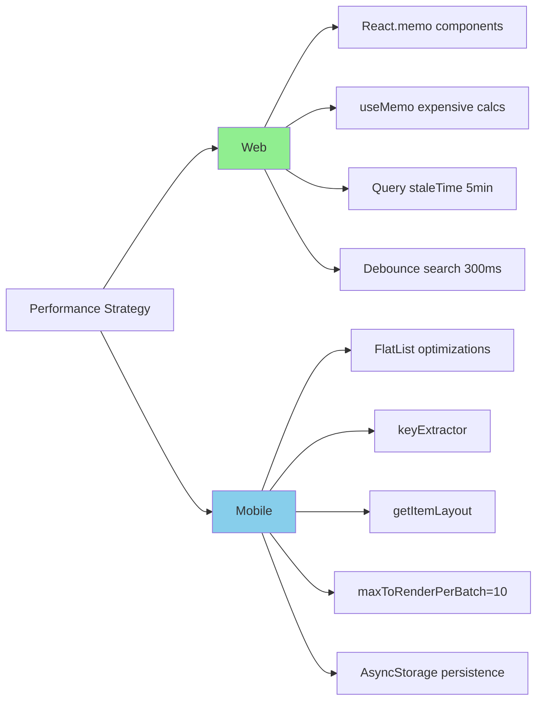

### Multi-tenant Architecture (Future)

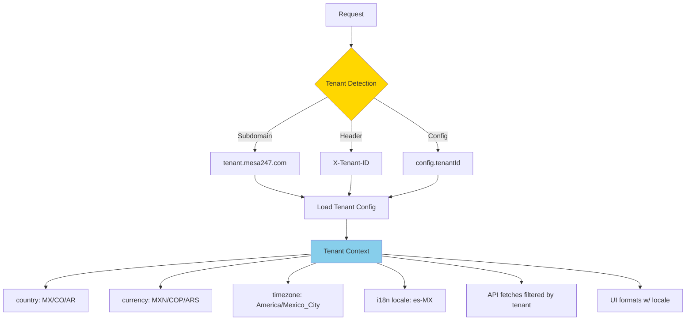
